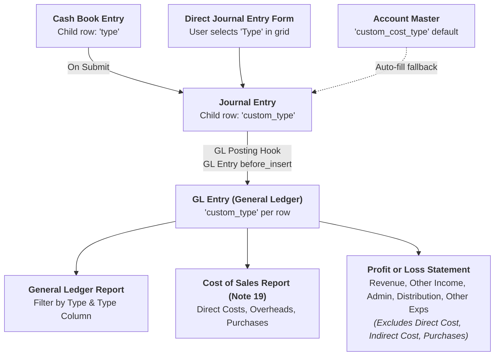

# Cash Book App: Transaction Classification & General Ledger Integration

## 1. Overview
The **Cash Book** (`cash_book`) app extends standard Frappe / ERPNext accounting functionality by introducing granular **Transaction Classification Tags (`Type`)** across transaction entries, journal vouchers, and the General Ledger.

This allows accounting entries to be categorized at the individual line level and seamlessly powers:
- **General Ledger filtering and reporting by Type**.
- **The Cost of Sales / Manufacturing Statement (Note 19)** directly from General Ledger entries.
- **The Statement of Profit or Loss and Comprehensive Income** directly from General Ledger entries, while strictly preventing production/cost of sales entries from double-counting in operating expenses.

---

## 2. Classification Tags (`Type`)
Each accounting line in transactions can be tagged with one of the following standard options:
- `Direct Cost`
- `Indirect Cost`
- `Direct Income`
- `Indirect Income`
- `Distribution costs`
- `Administrative expenses`
- `Other expenses`
- `Purchases`

---

## 3. Architecture & Data Flow

---

## 4. Key Components & Implementation Details

### A. Custom Fields (`fixtures/custom_field.json` & `setup_custom_fields.py`)
- **`Journal Entry Account`**:
  - Field: `custom_type` (Select, Label: *Type*)
  - Visible directly in the desk list view grid (`in_list_view: 1`).
- **`GL Entry`**:
  - Field: `custom_type` (Select, Label: *Type*)
  - Filterable and visible in standard filter (`in_standard_filter: 1`, `in_list_view: 1`, `search_index: 1`).
- **`Account`**:
  - Field: `custom_cost_type` (Select, Label: *Cost Type*)
  - Acts as the default fallback for accounts in Chart of Accounts.
- **`Journal Entry`**:
  - Field: `custom_cashbook_entry_ref` (Link to *Cash Book Entry*).

### B. Cash Book Entry Submission (`cash_book_entry.py`)
- When a `Cash Book Entry` is submitted, `create_custom_journal_entry` passes the `type` selected on each child row into the `custom_type` field of the created `Journal Entry Account` rows.

### C. Direct Journal Entry Desk UI (`public/js/journal_entry_custom.js`)
- In the Journal Entry form, accountants can choose or adjust the **Type** per row directly in the table grid.
- Selecting an Account automatically pre-populates its default `custom_cost_type` into `custom_type` if not already set.

### D. General Ledger Stamping (`api.py` & `hooks.py`)
- `doc_events` on `GL Entry`: `before_insert` executes `cash_book.cah_book.api.set_gl_entry_type`.
- Automatically stamps `custom_type` onto the `GL Entry` record from the matching `Journal Entry Account` row (with fallback to `Account.custom_cost_type`).

### E. General Ledger Report Enhancement (`public/js/general_ledger_custom.js` & `report_overrides.py`)
- **UI Filter**: Adds the **Type** dropdown filter to the top filter bar of the General Ledger report.
- **Column**: Adds the **Type** column to the report grid.
- **Query**: Filters `tabGL Entry` records dynamically when a Type is selected.

### F. Financial Reports Integration

#### 1. Cost of Sales Report (`cost_of_sales_report.py`)
- Direct Costs: Queries `tabGL Entry` where `Type = 'Direct Cost'` + Direct manufacture.
- Factory Overheads: Queries `tabGL Entry` where `Type = 'Indirect Cost'`.
- Purchases: Queries `tabGL Entry` where `Type = 'Purchases'` + Purchase Invoices.

#### 2. Statement of Profit or Loss (`statement_of_profit_or_loss_and_comprehensive_income.py`)
- Calculates Revenue (`Direct Income`), Other Income (`Indirect Income`), Distribution costs, Administrative expenses, and Other expenses from `tabGL Entry`.
- **Strict Exclusion**: GL entries tagged with `Direct Cost`, `Indirect Cost`, or `Purchases` are strictly excluded from general operating expenses on the P&L statement to prevent double-counting with Cost of Sales.

---

## 5. Automated Setup & Migration
All custom fields and hooks are automatically configured on any site via:
- `after_install`: `cash_book.setup_custom_fields.setup_all_custom_fields`
- `after_migrate`: `cash_book.setup_custom_fields.setup_all_custom_fields`
